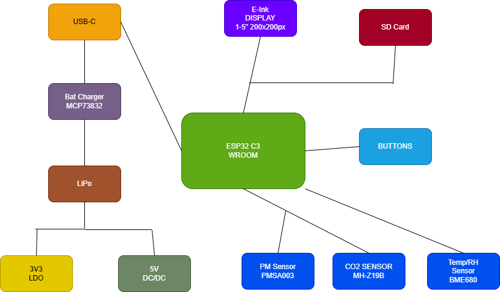

# OpenBook Reader

## 📘 Introduction  
**OpenBook Reader** is an open-source hardware project focused on delivering a practical, low-cost e-book device. Its primary aim is to build the physical design assets—such as schematics, board layouts, and casing models—needed for manufacturing the device according to system-level specs.

This initiative includes:
- Circuit design and layout.
- PCB preparation for fabrication.
- CAD models for enclosure and hardware integration.

---

## 🔧 Project Contents

This repository contains everything needed to bring the device to life, from electronics to mechanical files. Key folders include:

- **Electronics Design**
  - Circuit schematics  
  - Board layout data  
- **Fabrication Files**
  - Manufacturing exports (e.g., Gerbers)  
  - Assembly references (e.g., BOM, placement files)  
- **CAD Assets**
  - Mechanical parts in 3D format (STEP, Fusion360)  
- **Miscellaneous**
  - Licensing information  
  - Documentation  

---

## 📦 Components Summary

### Block Diagram

Below is a selection of the main components used in the hardware design. For each, you’ll find supplier and datasheet links for reference.

| Component                  | Product Link | Datasheet |
|---------------------------|--------------|-----------|
| ESP32-C6 Module           | [SnapEDA](https://www.snapeda.com/parts/ESP32-C6-WROOM-1-N8/Espressif+Systems/view-part/?ref=eda) | [PDF](https://www.snapeda.com/parts/ESP32-C6-WROOM-1-N8/Espressif%20Systems/datasheet/) |
| BME688 Sensor             | [SnapEDA](https://www.snapeda.com/parts/BME680/Bosch/view-part/?welcome=home) | [PDF](https://www.snapeda.com/parts/BME680/Bosch%20Sensortec/datasheet/) |
| MCP73831 Charger IC       | [Mouser](https://eu.mouser.com/ProductDetail/Microchip-Technology/MCP73831T-2ACI-OT) | [PDF](https://eu.mouser.com/datasheet/2/268/MCP73831_Family_Data_Sheet_DS20001984H-3441711.pdf) |
| DS3231 RTC Module         | [SnapEDA](https://www.snapeda.com/parts/DS3231SN%23/Analog+Devices/view-part/?ref=eda) | [PDF](https://www.snapeda.com/parts/DS3231SN%23/Analog%20Devices/datasheet/) |
| W25Q512JVEIQ Flash Memory | [SnapEDA](https://www.snapeda.com/parts/W25Q512JVEIQ/Winbond+Electronics/view-part/?ref=eda) | [PDF](https://www.snapeda.com/parts/W25Q512JVEIQ/Winbond%20Electronics/datasheet/) |
| USB-C Connector           | [GCT](https://componentsearchengine.com/part-view/USB4110-GF-A/GCT%20(GLOBAL%20CONNECTOR%20TECHNOLOGY)) | [PDF](https://gct.co/files/drawings/usb4110.pdf) |

> Additional passives (resistors, capacitors, inductors, etc.) are chosen based on standard values and footprints for cost-effective production.

---

## 🧠 Key Modules and Functionality

### 🟡 Power System  
- **Battery:** Rechargeable Li-Po providing 3.7V, 1800mAh capacity.  
- **Charger:** Manages safe charging through USB-C.  
- **Regulation:** LDOs provide clean power to different system sections.

### 🔲 Display Unit  
- **Type:** 7.5-inch e-paper screen (black & white).  
- **Comms:** SPI-based, ultra-low-power refresh.

### 🎛 Microcontroller  
- **Model:** ESP32-C6  
- **Role:** Central processor managing all I/O, display, memory, and sensors.  
- **Connectivity:** Offers Wi-Fi and Bluetooth for syncing or updates.

### 🌦 Environmental Sensor  
- **Chip:** BME688  
- **Function:** Captures environmental data (temp, pressure, humidity, gas).

### 🕒 Real-Time Clock  
- **RTC:** DS3231  
- **Use Case:** Keeps time even without power—great for tracking usage.

### 💾 Storage  
- **Flash Memory:** For storing firmware and runtime data.  
- **SD Card Support:** Optional external storage for large file handling (e.g. e-books).

### 🧩 Expandability  
- **Connectors:** I2C/SPI breakout headers support add-on modules.  
- **Test Points:** Available for programming, debugging, and diagnostics.

---

## 🔌 Interfaces & I/O

| Interface | Purpose |
|----------|---------|
| **SPI**  | Display, SD Card, Flash Memory |
| **I2C**  | Sensor, RTC |
| **USB-C**| Charging & data |
| **GPIO** | Button inputs, status indicators |

---

## 📃 License  
This project is released under the MIT License—feel free to use, remix, and contribute.
