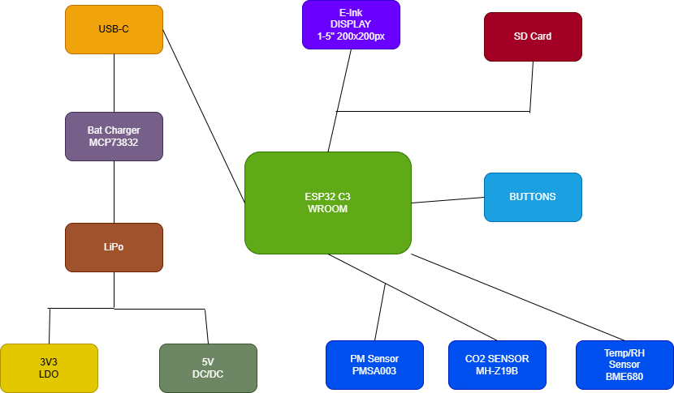

# OpenBook Reader

## 📘 Introduction  
**OpenBook Reader** is an open-source hardware project focused on delivering a practical, low-cost e-book device. Its primary aim is to build the physical design assets—such as schematics, board layouts, and casing models—needed for manufacturing the device according to system-level specs.

This initiative includes:
- Circuit design and layout.
- PCB preparation for fabrication.
- CAD models for enclosure and hardware integration.

---

## 🔧 Project Contents

This repository contains everything needed to bring the device to life, from electronics to mechanical files. Key folders include:

- **Electronics Design**
  - Circuit schematics  
  - Board layout data  
- **Fabrication Files**
  - Manufacturing exports (e.g., Gerbers)  
  - Assembly references (e.g., BOM, placement files)  
- **CAD Assets**
  - Mechanical parts in 3D format (STEP, Fusion360)  
- **Miscellaneous**
  - Licensing information  
  - Documentation  

---

## 📦 Components Summary

### Block Diagram

Below is a selection of the main components used in the hardware design. For each, you’ll find supplier and datasheet links for reference.

## Bill of Materials (BOM)

| Component                       | Link                                                                                                | Datasheet                                                                                             |
| :------------------------------ | :-------------------------------------------------------------------------------------------------- | :------------------------------------------------------------------------------------------------------ |
| ESP32-C6 WROOM-1-N8             | [SnapMagic](https://www.snapeda.com/parts/ESP32-C6-WROOM-1-N8/Espressif+Systems/view-part/?ref=eda) | [Datasheet](https://www.snapeda.com/parts/ESP32-C6-WROOM-1-N8/Espressif%20Systems/datasheet/)       |
| ESP32C6 Varistor 1812           | [Mouser](https://ro.mouser.com/ProductDetail/EPCOS-TDK/B72520T0350K062?qs=dEfas%2FXlABIszF52uu7vrg%3D%3D) | [Datasheet](https://www.tdk-electronics.tdk.com/inf/75/db/CTVS_14/Surge_protection_series.pdf)     |
| ESP32 WROVER 0805 Capacitor     | [Mouser](https://ro.mouser.com/ProductDetail/KYOCERA-AVX/SD0805S020S1R0?qs=jCA%252BPfw4LHbpkAoSnwrdjw%3D%3D) | [Datasheet](https://ro.mouser.com/datasheet/2/40/schottky-3165252.pdf)                               |
| ESP32 WROVER BME680 Sensor      | [SnapMagic](https://www.snapeda.com/parts/BME680/Bosch/view-part/?welcome=home)                      | [Datasheet](https://www.snapeda.com/parts/BME680/Bosch%20Sensortec/datasheet/)                           |
| ESP32 WROVER MCP73831 Power Management | [Mouser](https://eu.mouser.com/ProductDetail/Microchip-Technology/MCP73831T-2ACI-OT?qs=yUQqVecv4qvbBQBGbHx0Mw%3D%3D) | [Datasheet](https://eu.mouser.com/datasheet/2/268/MCP73831_Family_Data_Sheet_DS20001984H-3441711.pdf) |
| ESP32 WROVER P-Channel MOSFET   | [Component Search Engine](https://componentsearchengine.com/part-view/DMG2305UX-7/Diodes%20Incorporated) | [Datasheet](https://www.diodes.com//assets/Datasheets/DMG2305UX.pdf)                                  |
| LED Chip 0603                   | [SnapMagic](https://www.snapeda.com/parts/KP-1608SURCK/Kingbright/view-part/?ref=search&t=LED%200603) | [Datasheet](https://www.snapeda.com/parts/KP-1608SURCK/Kingbright/datasheet/)                           |
| SJ                              | [GrabCad](https://grabcad.com/library/solder-jumpers-1)                                             | [Datasheet](https://www.youtube.com/watch?v=dQw4w9WgXcQ)                                                 |
| LTSPICE Resistor 0402           | [Component Search Engine](https://componentsearchengine.com/part-view/R0402%201%25%20100%20K%20(RC0402FR-07100KL)/YAGEO) | [Datasheet](https://www.yageo.com/upload/media/product/products/datasheet/rchip/PYu-RC_Group_51_RoHS_L_12.pdf) |
| RCL CPOL 3528                   | [SnapMagic](https://www.snapeda.com/parts/TAJB475K025RNJ/AVX/view-part/?ref=dk&t=capacitor%203528&con_ref=None) | [Datasheet](https://s3.amazonaws.com/snapeda/datasheet/TAJB475K025RNJ_AVX.pdf)                       |
| 112A-TAAR-R03                   | [Comet](https://store.comet.srl.ro/Catalogue/Product/43497/)                                       | [Datasheet](https://store.comet.bg/download-file.php?id=27596)                                       |
| Capacitor 0402                  | [Component Search Engine](https://componentsearchengine.com/part-view/CC0402MRX5R5BB106/YAGEO)      | [Datasheet](https://componentsearchengine.com/Datasheets/2/CC0402MRX5R5BB106.pdf)                      |
| 744043680 IND                   | [Mouser](https://eu.mouser.com/ProductDetail/Wurth-Elektronik/744043680?qs=PGXP4M47uW6VkZq%252BkzjrHA%3D%3D) | [Datasheet](https://www.we-online.com/components/products/datasheet/744043680.pdf)                   |
| BD5229G-TR                      | [Component Search Engine](https://componentsearchengine.com/part-view/BD5229G-TR/ROHM%20Semiconductor) | [Datasheet](https://datasheet.datasheetarchive.com/originals/distributors/Datasheets_SAMA/f2b9741ef86007909f138d561a359946.pdf) |
| Custom Button                   | [Panasonic](https://industry.panasonic.com/global/en/products/control/switch/light-touch/number/evqpuj02k) | [Datasheet](https://industry.panasonic.com/global/en/downloads?tab=catalog&small_g_cd=203&part_no=EVQPUJ02K&q=RVZRUFVKMDJLJTdDMTMlN0MyMDMlN0MzNDU5JTdDMSU3QyU3QzIlN0M%3D) |
| CPH3225A                        | [SnapMagic](https://www.snapeda.com/parts/CPH3225A/Seiko+Instruments/view-part/?ref=eda)           | [Datasheet](https://www.snapeda.com/parts/CPH3225A/Seiko%20Instruments/datasheet/)                       |
| DS3231SN RTC                    | [SnapMagic](https://www.snapeda.com/parts/DS3231SN%23/Analog+Devices/view-part/?ref=eda)          | [Datasheet](https://www.snapeda.com/parts/DS3231SN%23/Analog%20Devices/datasheet/)                      |
| FH34SRJ-24S-0.5SH Connector     | [Component Search Engine](https://componentsearchengine.com/part-view/FH34SRJ-24S-0.5SH(99)/Hirose) | [Datasheet](https://www.hirose.com/en/product/document?clcode=CL0580-1255-6-99&productname=FH34SRJ-24S-0.5SH(99)&series=FH34SRJ&documenttype=2DDrawing&lang=en&documentid=0000990903) |
| MAX17048G+T10 Battery Fuel Gauge | [SnapMagic](https://www.snapeda.com/parts/MAX17048G+T10/Analog+Devices/view-part/?ref=eda)         | [Datasheet](https://www.snapeda.com/parts/MAX17048G+T10/Analog%20Devices/datasheet/)                    |
| MBR0530 Schottky Diode         | [SnapMagic](https://www.snapeda.com/parts/MBR0530/Onsemi/view-part/?ref=eda)                      | [Datasheet](https://www.snapeda.com/parts/MBR0530/ON%20Semiconductor/datasheet/)                         |
| PGB1010603MR Inductor          | [SnapMagic](https://www.snapeda.com/parts/PGB1010603MR/Littelfuse/view-part/?ref=eda)              | [Datasheet](https://www.snapeda.com/parts/PGB1010603MR/Littelfuse%20Inc./datasheet/)                     |
| QWIIC Connector                 | [Mouser](https://eu.mouser.com/ProductDetail/Adafruit/4208?qs=PzGy0jfpSMtbScLbr0L5dw%3D%3D)         | [Datasheet](https://www.youtube.com/watch?v=dQw4w9WgXcQ)                                                 |
| USB4110-GF-A USB Hub            | [Component Search Engine](https://componentsearchengine.com/part-view/USB4110-GF-A/GCT%20(GLOBAL%20CONNECTOR%20TECHNOLOGY)) | [Datasheet](https://gct.co/files/drawings/usb4110.pdf)                                                 |
| SI1308EDL-T1-GE3 MOSFET         | [SnapMagic](https://www.snapeda.com/parts/SI1308EDL-T1-GE3/Vishay+Siliconix/view-part/?ref=eda)   | [Datasheet](https://www.youtube.com/watch?v=dQw4w9WgXcQ)                                                 |
| TPTP20R                         | [Comet](https://easyeda.com/component/7524403feb2642ac9f9f26dfb93ceacf)                            | [Datasheet](https://easyeda.com/component/7524403feb2642ac9f9f26dfb93ceacf)                              |
| USBLC6-2SC6Y USB Surge Protection | [SnapMagic](https://www.snapeda.com/parts/USBLC6-2SC6Y/STMicroelectronics/view-part/?ref=eda)    | [Datasheet](https://www.snapeda.com/parts/USBLC6-2SC6Y/STMicroelectronics/datasheet/)                   |
| W25Q512JVEIQ Flash Memory       | [SnapMagic](https://www.snapeda.com/parts/W25Q512JVEIQ/Winbond+Electronics/view-part/?ref=eda)     | [Datasheet](https://www.snapeda.com/parts/W25Q512JVEIQ/Winbond%20Electronics/datasheet/)                |
| XC6220A331MR-G Voltage Regulator | [Component Search Engine](https://componentsearchengine.com/part-view/XC6220A331MR-G/Torex)      | [Datasheet](https://product.torexsemi.com/system/files/series/xc6220.pdf)                               |

---

## 🧠 Key Modules and Functionality

### 🟡 Power System  
- **Battery:** Rechargeable Li-Po providing 3.7V, 1800mAh capacity.  
- **Charger:** Manages safe charging through USB-C.  
- **Regulation:** LDOs provide clean power to different system sections.

### 🔲 Display Unit  
- **Type:** 7.5-inch e-paper screen (black & white).  
- **Comms:** SPI-based, ultra-low-power refresh.

### 🎛 Microcontroller  
- **Model:** ESP32-C6  
- **Role:** Central processor managing all I/O, display, memory, and sensors.  
- **Connectivity:** Offers Wi-Fi and Bluetooth for syncing or updates.

### 🌦 Environmental Sensor  
- **Chip:** BME688  
- **Function:** Captures environmental data (temp, pressure, humidity, gas).

### 🕒 Real-Time Clock  
- **RTC:** DS3231  
- **Use Case:** Keeps time even without power—great for tracking usage.

### 💾 Storage  
- **Flash Memory:** For storing firmware and runtime data.  
- **SD Card Support:** Optional external storage for large file handling (e.g. e-books).

### 🧩 Expandability  
- **Connectors:** I2C/SPI breakout headers support add-on modules.  
- **Test Points:** Available for programming, debugging, and diagnostics.

---

## 🔌 Interfaces & I/O

| Interface | Purpose |
|----------|---------|
| **SPI**  | Display, SD Card, Flash Memory |
| **I2C**  | Sensor, RTC |
| **USB-C**| Charging & data |
| **GPIO** | Button inputs, status indicators |

---

## 📃 License  
This project is released under the MIT License—feel free to use, remix, and contribute.
